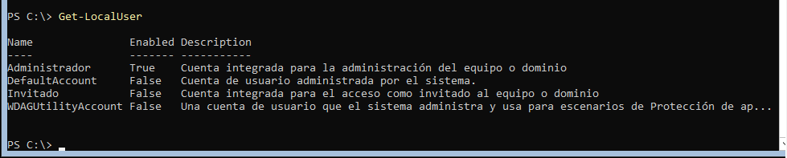
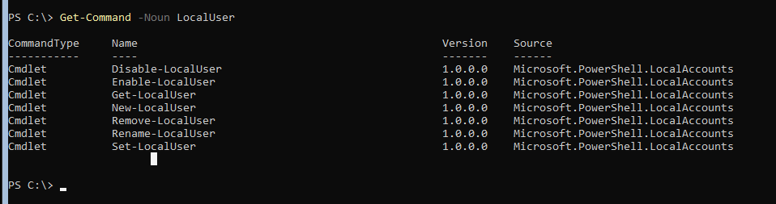
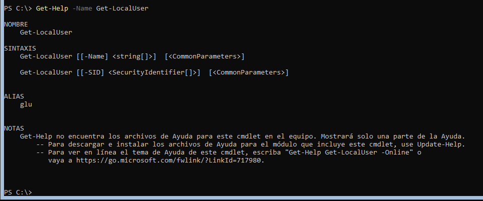
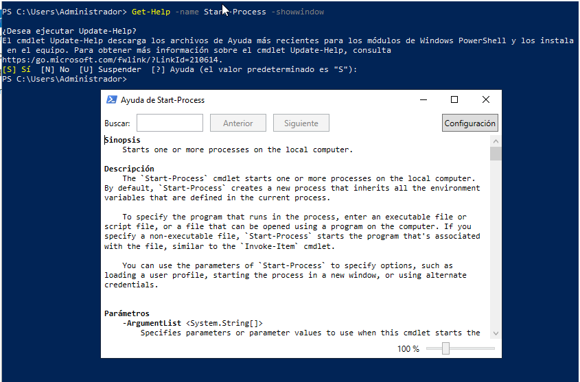
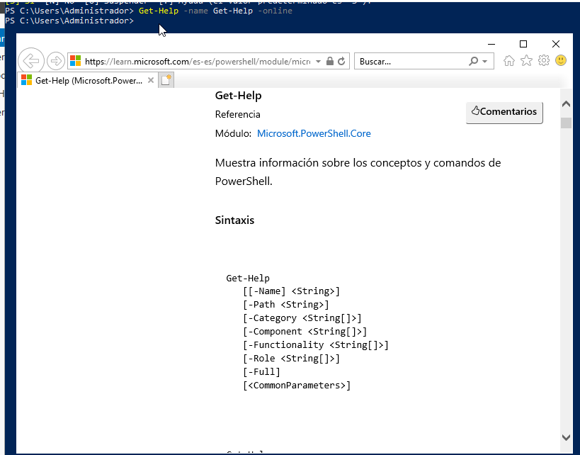
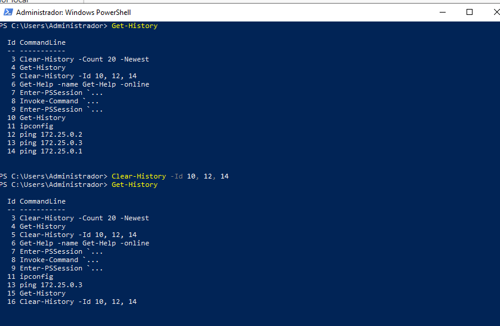

# PR0401: Introducción a powershell
1.

2.

3.

4.
El comando Set-Content sirve para modificar el contenido de un fichero, es como el comando nano en linux.

5.
Se puede navegar con teclas Ctrl-R y Ctrl-S, la primera para buscar hacia atrás y la segunda para buscar hacia adelante, también con el comando Get-History(h) o con el comando Invoke-History(r).

6.
Sí, tiene el parámetro ComputerName, y sirve para obtener procesos en equipos remotos.

7. 

8.

9.

10.

