# PR0402: Introducción a powershell(II)

1.
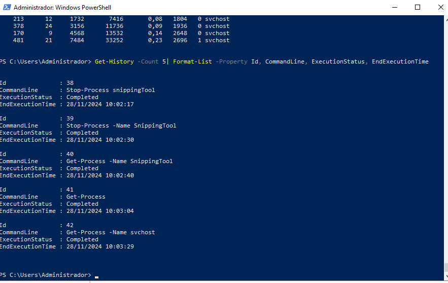

2.
Comando Get-Command interrumpido:
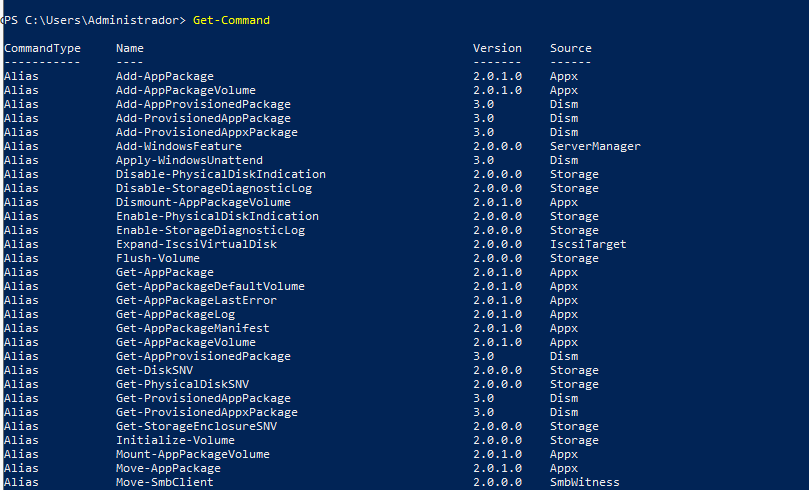
Comando Get-Command completo:
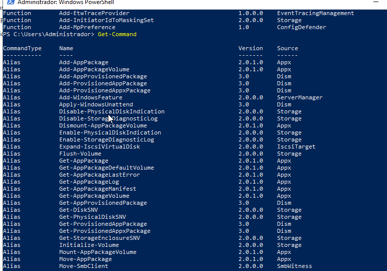

3.
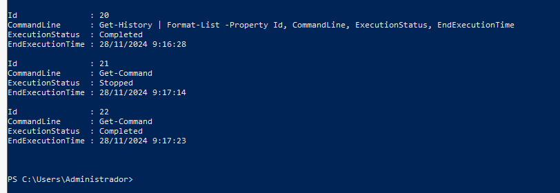

4.
Lo hice con el proceso iexplore porque el servidor no tiene microsoft edge.
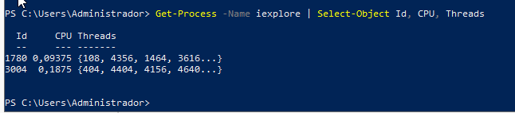

5.
El parámetro -Delimiter sirve para separar valores de las propiedades del archivo csv, por defecto es una coma(,).

6.
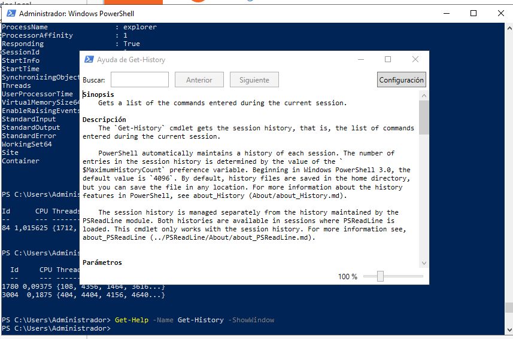

7. 
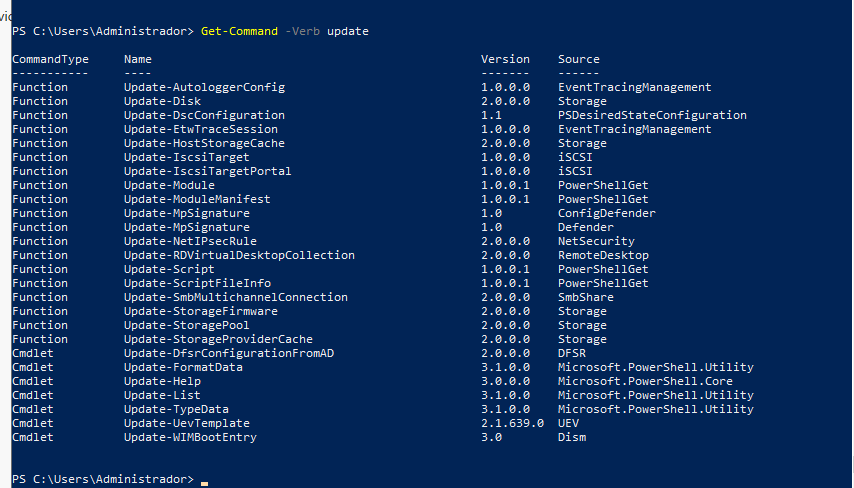

8.
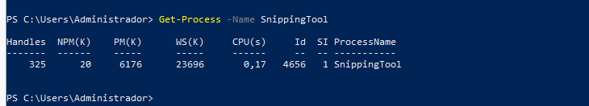

9.
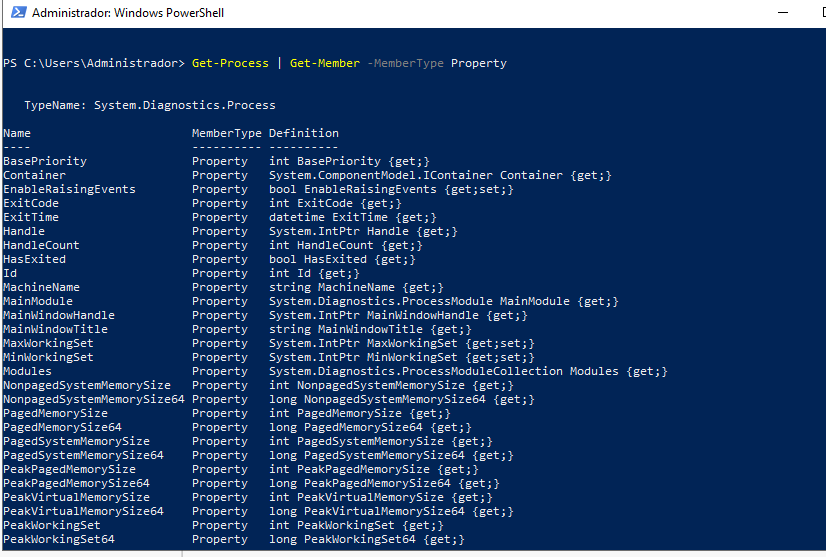

10.
El parámetro -MemberType sirve para especificar el tipo de miembro que obtiene el comando.

11.

11.
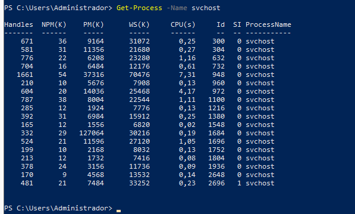

13.
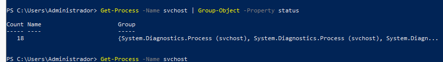

14.

15.
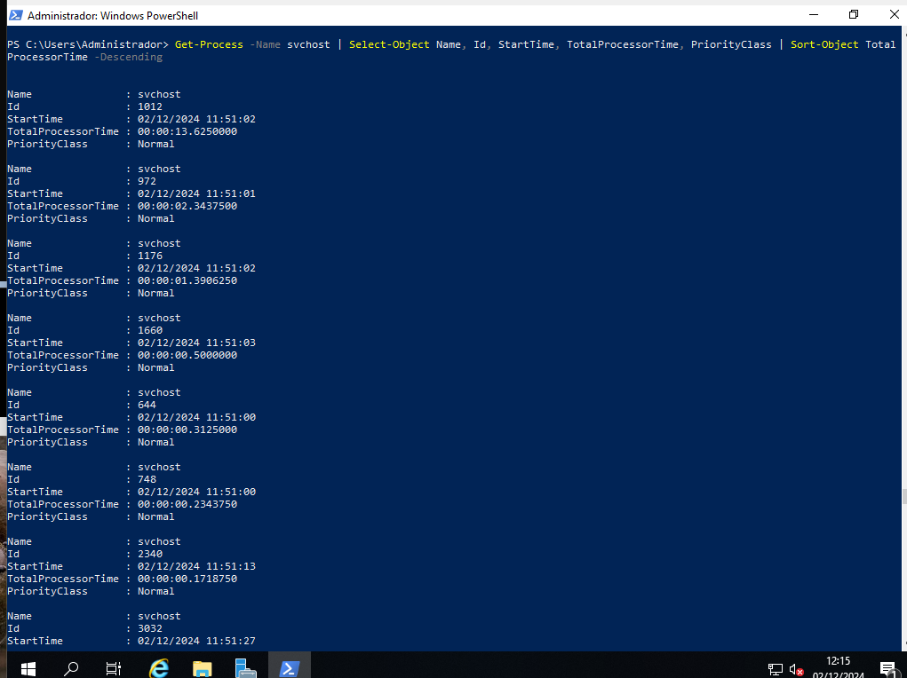

16.
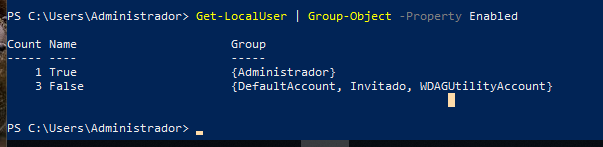

17.

18.
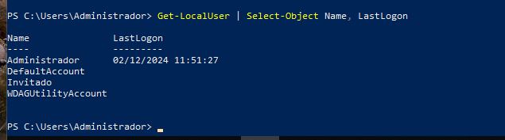
