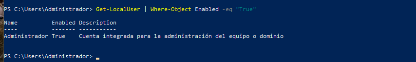

# PR0402: Introducción a powershell(II)

1. Visualiza las últimas cinco entradas del historial, mostrando para cada una el comando, la hora en que finalizó su ejecución y el estado de ejecución.

2. Ejecuta el comando Get-Command (que muestra todos los comandos disponibles en Powershell) e interrúmpelo antes de que finalice su ejecución pulsando las teclas Ctrl-C. A continuación, ejecútalo dejando que finalice correctamente.

Comando Get-Command interrumpido:

Comando Get-Command completo:

3. Vuelve a ejecutar el comando del punto 1 y comprueba las diferentes salidas de finalización de estado de ejecución.

4. Muestra todos los procesos con el nombre msedge mostrando para cada uno el identificador, el consumo de CPU y los hilos (threads)

Lo hice con el proceso iexplore porque el servidor no tiene microsoft edge.

5. Averigua para qué sirve el parámetro -Delimiter del comando Export-CSV

El parámetro -Delimiter sirve para separar valores de las propiedades del archivo csv, por defecto es una coma(,).

6. Muestra en una ventana la ayuda del comando Get-History

7. Muestra un listado con todos los comandos que tengan el verbo Update.

8. Ejecuta la herramienta Recortes y localízala usando el comando Get-Process teniendo en cuenta que el proceso se llama SnippingTool.exe

9. Averigua qué propiedades tienen los procesos devueltos con el comando Get-Process.

10.Busca en la ayuda para qué sirve el parámetro -MemberType del comando Get-Member.

El parámetro -MemberType sirve para especificar el tipo de miembro que obtiene el comando.

11. Desde la línea de comandos, finaliza la ejecución de la herramienta Recortes.

12. Muestra todos los procesos que tienen el nombre svchost.

13. Muestra por pantalla el número de instancias del proceso svchost.

14. Muestra por pantalla todos los procesos con el nombre svchost mostrando para cada uno: nombre, identificador, hora de inicio, tiempo total de procesador y clase de prioridad. Se deben mostrar de forma tabular.

15. Repite la búsqueda anterior, pero ordenando por el campo tiempo total de procesador en sentido descendente.

16. Muestra los usuarios que hay en el sistema agrupándolos por la propiedad Enabled.

17. Muestra los usuarios que hay en el sistema con la cuenta habilitada (propiedad Enabled puesta a True). Utiliza el filtrado con el comando Where-Object

18. Muestra un listado de todos los usuarios del sistema con el nombre y la fecha de la última vez que iniciaron sesión (tienes que buscar la propiedad que indique último inicio de sesión o last logon)

