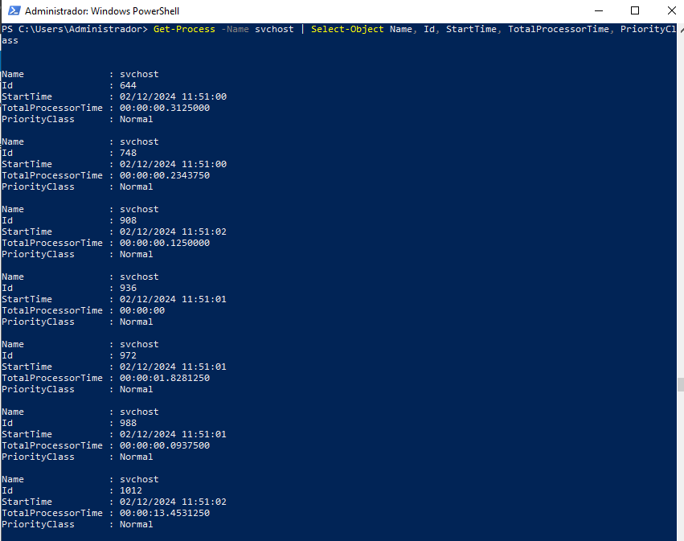

# PR0402: Introducción a powershell(II)

1.

2.
Comando Get-Command interrumpido:

Comando Get-Command completo:

3.

4.
Lo hice con el proceso iexplore porque el servidor no tiene microsoft edge.

5.
El parámetro -Delimiter sirve para separar valores de las propiedades del archivo csv, por defecto es una coma(,).

6.

7. 

8.

9.

10.
El parámetro -MemberType sirve para especificar el tipo de miembro que obtiene el comando.

11.

11.

13.

14.

15.

16.

17.

18.

