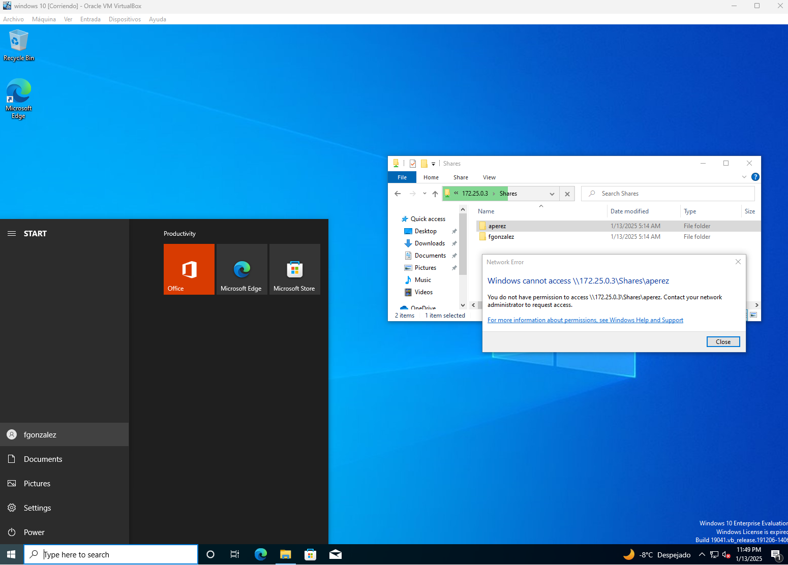
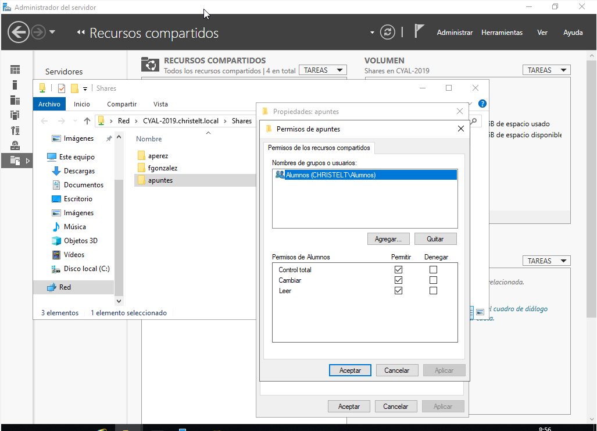
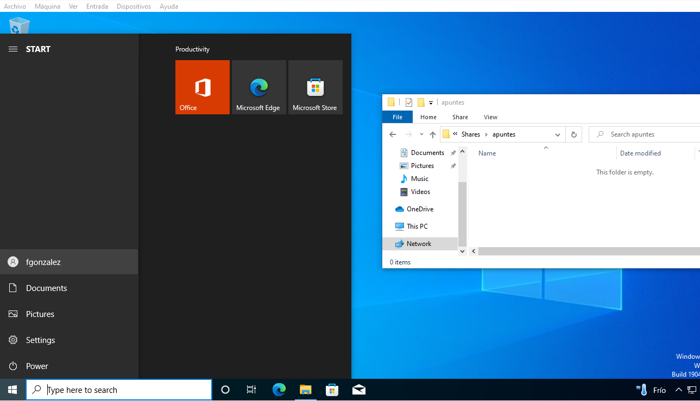
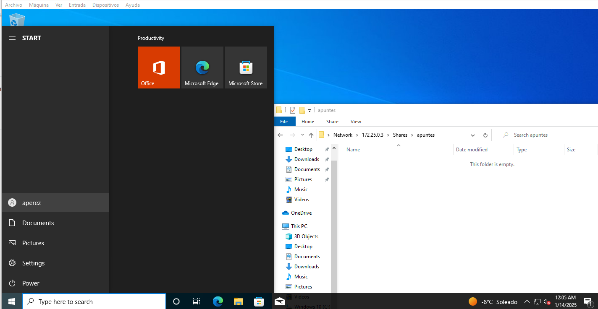

# PR0501: Carpetas personales y compartidas por un grupo 
## Pasos que seguí
Para la carpeta personal:
1.
Creé los usuarios dentro del dominio, así como el grupo global, luego añadí los usuarios dentro del grupo.
2.
Instalé el rol de Servicios de archivos y almacenamiento, posteriormente, en el Administrador del servidor, en Servicios de archivos y almacenamiento, en Recursos compartidos compartí la carpeta C:/Shares.
3.
Luego en Herramientas, Usuarios y equipos de Active directory, seleccioné los usuarios que creé, click derecho propiedades, en Perfil, en Carpeta particular puse 'Conectar' y luego le asigné la letra H:
4.
Finalmente, inicié sesión en los dos perfiles y ya tenían la unidad de red, y me aseguré de que solo puedieran entrar a la carpeta que le corresponde a cada usuario:

Para la carpeta compartida:
1. Creé la carpeta apuntes dentro de la carpeta 'Shares', luego le di click derecho propiedades, y en la pestaña compartir, le di a 
Uso compartido avanzado, luego marqué la casilla 'Compartir carpeta' y en Permisos, quité el grupo 'Todos' y agregué al grupo 'Alumnos'.

Luego comprobé que ambos usuarios puedan acceder a ella:
    Usuario fgonzalez: 

    Usuario aperez: 