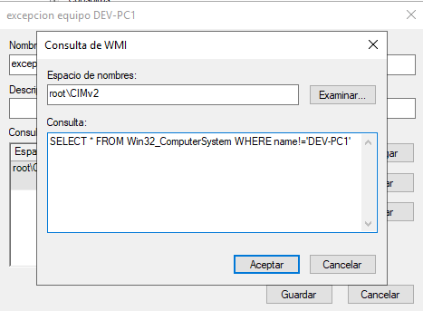

# PR0502: Aplicación de directivas
## Pasos que seguí
Para esta práctica lo primero que hice fue crear las unidades organizativas:
-management: dentro de esta unidad creé el usuario mgmt_director y metí al grupo usuarios del dominio.
-development: dentro de esta unidad creé el usuario dvlp_director y metí al grupo usuarios del dominio.
-equipos: aquí metí al grupo equipos del dominio.

1. Para la directiva 1:
    En la unidad management le dí click derecho y 'Crear un GPO en este dominio y vincularlo aquí',
    se creó la GPO y la llamé directiva 1. Luego le di click derecho a la directiva y 'Editar', ahí seguí los pasos de la práctica hasta encontrar 'Impedir cambiar el fondo de pantalla', lo habilité y después, para que se le aplique a la UO management, en el filtrado de seguridad agregué al grupo de usuarios del dominio.

2. Para la directiva 2:
    Aquí creé la GPO vinculada a la UO development y luego la edité y habilité 'Activar la ejecución de scripts' y en 'Directiva de ejecución' puse 'Permitir todos los scripts'. Después en el filtrado de seguridad puse al grupo usuarios del dominio.

3. Para la directiva 3:
    Creé la GPO en la UO equipos, la edité y habilité el Firewall para el dominio. En el filtrado  de seguridad puse al grupo equipos del dominio y en el filtrado WMI creé un filtro para que se haga excepción al equipo 'DEV-PC1' con esta consulta:
    

4. Para la directiva 4:
    Creé la GPO vinculada a la UO equipos y habilité 'Configurar Actualizaciones automáticas'. 
    Y también el filtrado puse al grupo equipos del dominio.

5. Para la directiva 5:
    Creé la GPO en la UO equipos, la edité y habilité 'Unidades de disquete: denegar acceso de lectura' y también 'Unidades de disquete: denegar acceso de escritura'. Por último, en el filtrado de seguridad agregué al grupo equipos del dominio.

6. Para la directiva 6:
    Creé la directiva en el dominio y la edité, fui a 'Configuración del equipo-->Configuración de Windows-->Configuración de seguridad-->Directivas de cuenta-->Directiva de contraseñas' y habilité 'Exigir historial de contraseñas' y establací el valor en 10, luego en el filtrado de seguridad agregué al grupo usuarios del dominio.

7. Para la directiva 7:
    Creé la GPO vinculada a la UO equipos, luego la edité, habilité ''  

